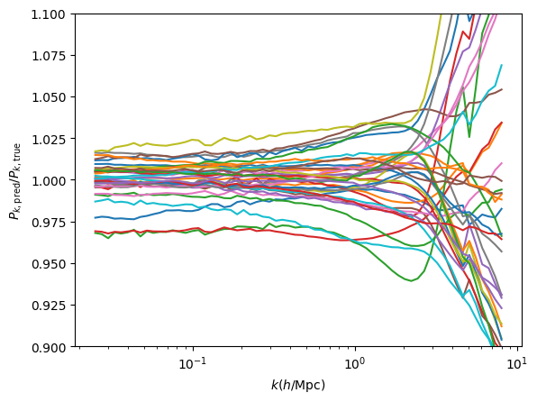
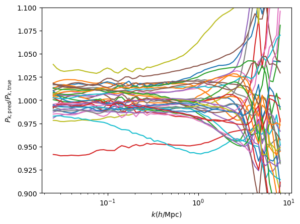
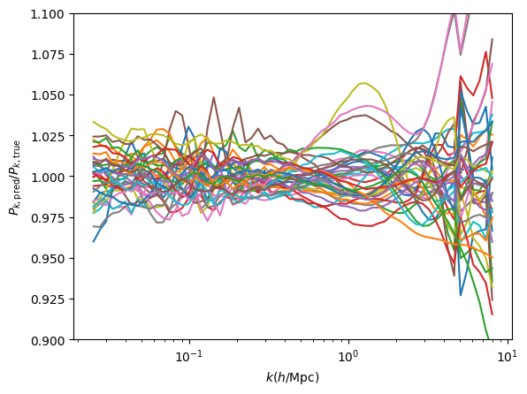
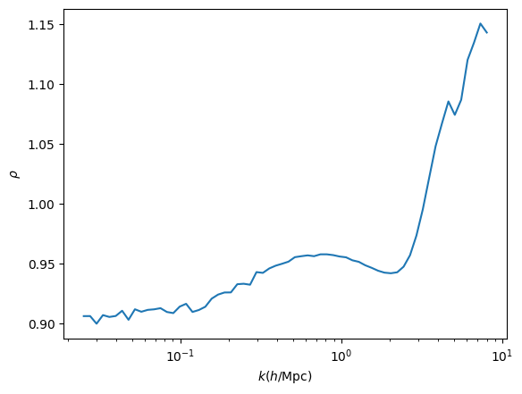
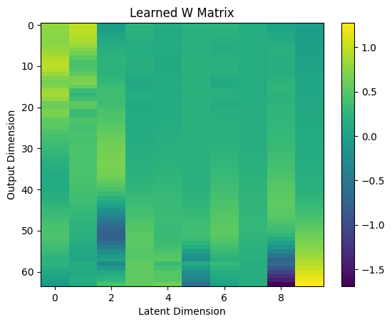

# multi_fidelity_gpflow

An implementation of multi-fidelity emulators from emukit using GPFlow. The multi-fidelity kernel relies on Kennedy & O’Hagan, 2000,
which uses a linear cross-covariance matrix to link the low- and high-fidelity data:

This kernel models the high-fidelity function as:

    f_H(x) = ρ * f_L(x) + δ(x)

where:
    - f_L(x) is a Gaussian process modeling the low-fidelity function.
    - δ(x) is an independent GP modeling discrepancies.
    - ρ is a learnable scaling factor.

The linear multi-fidelity is largely re-written from emukit's kernel implementation into gpflow's kernel implementation. See `mfgpflow/linear.py`.

We include additional implementations to extend the idea of linear multi-fidelity to multi-output, using sparse gp and linearcoregionalization, see section below `Demo: For testing Ho-Bird-Shelton 2021 50LF-3HF DM only power spectra` and `mfgpflow/linear_svgp.py`.

Necessary Packages

- check_shapes==1.1.1
- gpflow==2.9.0
- h5py==3.12.1
- matplotlib==3.10.0
- numpy==1.23.5
- pytest==8.3.4
- scikit_learn==1.6.1
- scipy==1.15.2
- tensorflow_macos==2.10.0

GPFlow has to be 2.9. The tensorflow version can see https://gpflow.github.io/GPflow/develop/installation.html. I use the suggested tensorflow and tensorflow-probability version pair.

```bash
pip install gpflow tensorflow~=2.10.0 tensorflow-probability~=0.18.0
```

## Demo: For testing Forrester function

```bash
python tests/test_forrest.py
```


## Demo: For testing Ho-Bird-Shelton 2021 50LF-3HF DM only power spectra

### 1) Multi-bin

```bash
# you need pip install pytest
pytest tests/test_ho2021_multibin.py
```

Also check `notebooks/demo: matter power.ipynb`

### 2) Single-bin Sparse GP

This is making use of multi-output kernel in GPFlow, so is expected to be faster than looping k bins in the old version.

```bash
# you need pip install pytest
pytest tests/test_ho2021_singlebin.py # This runs quite slowly
```

Also check `notebooks/demo: matter power single bin.ipynb`

### 3) Latent Sparse GP multi-output

This is making use of linear-coregionalization kernel in GPflow, ideally will do the factor analysis (linear low-rank decomposition) inside the GP training. So reduce the num output bins GP to low-rank num of latent GPs to train.

Check `notebooks/demo: matter power latent inference.ipynb`

## Demo: For testing z=0 Goku matter power spectra


Check `notebooks/demo: goku power spectra.ipynb`. It takes multi-bin, single-bin, and latent inference all together. But I haven't tested the save/load function. So probably need to read the gpflow doc to know how to save.

Summary of the time costs by each method (on my 2023 Macbook Pro M1 chip, CPU)


| Method               | Estimated Time |
|----------------------|---------------|
| Multi-bin Inference | 137.63 seconds |
| Single-bin Inference | 1724.09 seconds |
| Latent Inference    | 539.54 seconds |

### Pred/Exact in test set

1) Multi-bin: 



2) Single-bin:



3) Latent inference:



### Diagnostic plots

A few ways you can debug/interpret your inference results. First thing you can do is looking at the single-bin inference's lengthscales and scale parameters. Here we only look at scale parameters rho(k)



There is an apparent power suppression at higher k due to LF's resolution limitation, so higher rho to scale up the suppression.

Another plot is to view the mixing matrix W learned from the latent inference, this way we can know how much different output bins (k modes in this case) are correlated, so we can reduce the number of hyperparameters to train.



---
_Last updated: [2025/02/17]_

